# Frontend Mentor - Contact form solution


[](https://www.frontendmentor.io/)
[](https://vitejs.dev)


This is a solution to the [Contact form challenge on Frontend Mentor](https://www.frontendmentor.io/challenges/contact-form--G-hYlqKJj). Frontend Mentor challenges help you improve your coding skills by building realistic projects.

## Table of contents

- [Overview](#overview)
  - [The challenge](#the-challenge)
  - [Screenshot](#screenshot)
  - [Links](#links)
- [My process](#️my-process)
  - [Built with](#built-with)
  - [Architecture](#architecture)
  - [Accesibility](#accessibility)
  - [What I learned](#what-i-learned)
  - [Continued development](#continued-development)
  - [Useful resources](#useful-resources)
  - [AI Collaboration](#ai-collaboration)
- [Author](#author)
- [Acknowledgments](#acknowledgments)

---

## 📖Overview

### The challenge

Users should be able to:

- Complete the form and see a success toast message upon successful submission
- Receive form validation messages if:
  - A required field has been missed
  - The email address is not formatted correctly
- Complete the form only using their keyboard
- Have inputs, error messages, and the success message announced on their screen reader
- View the optimal layout for the interface depending on their device's screen size
- See hover and focus states for all interactive elements on the page

---

### 📸Screenshot

#### Mobile (375x914)

| _Default_ | _Hover_ | _Active_ | _Error_ | _Success State_ |
| --------- | ------- | -------- | ------- | --------------- |
| 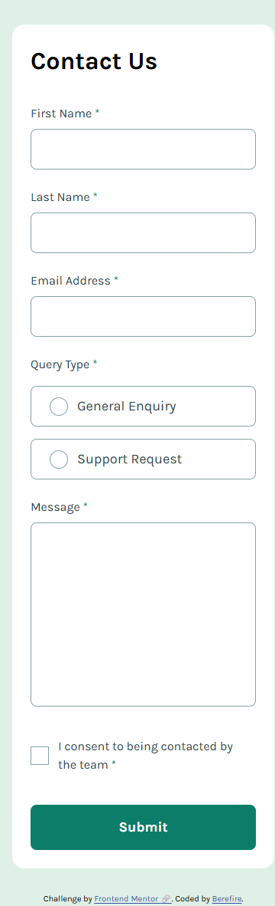 | 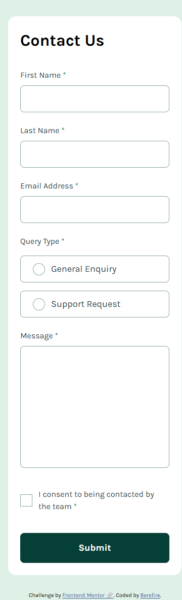 | 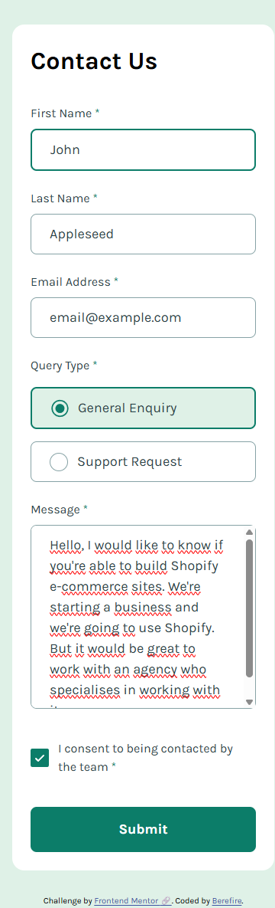 | 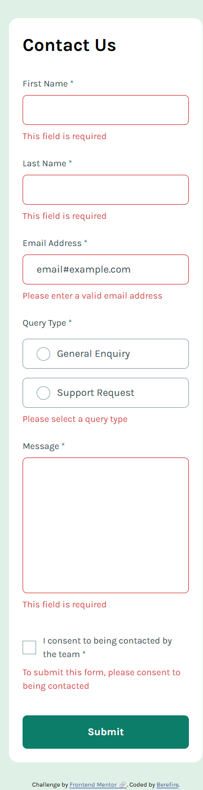 | 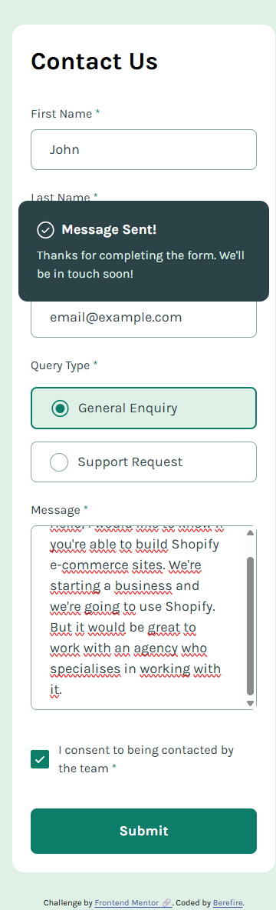 |

#### Tablet (768x914)

| _Default_ | _Hover_ | _Active_ | _Error_ | _Success State_ |
| --------- | ------- | -------- | ------- | --------------- |
| 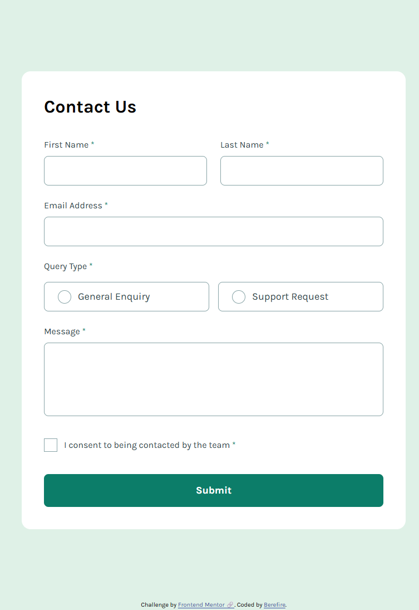 | 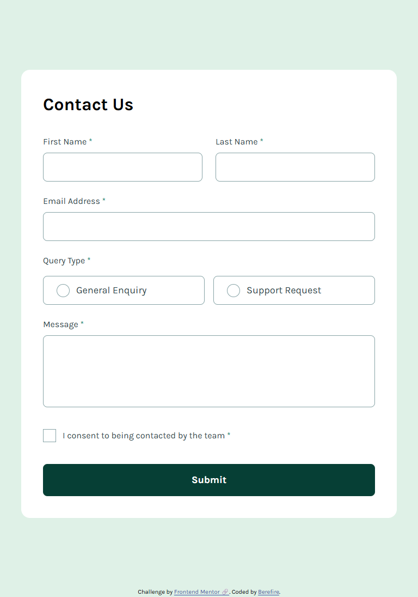 | 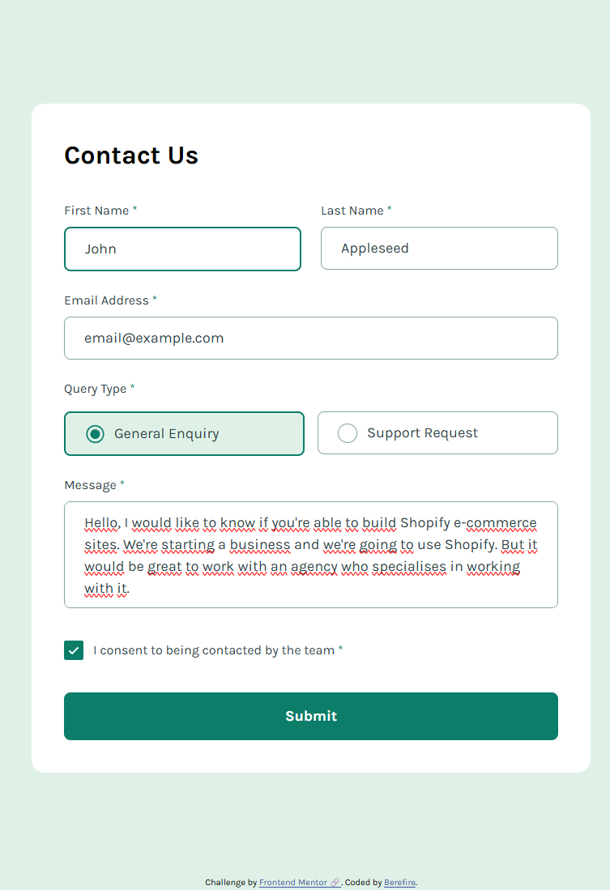 | 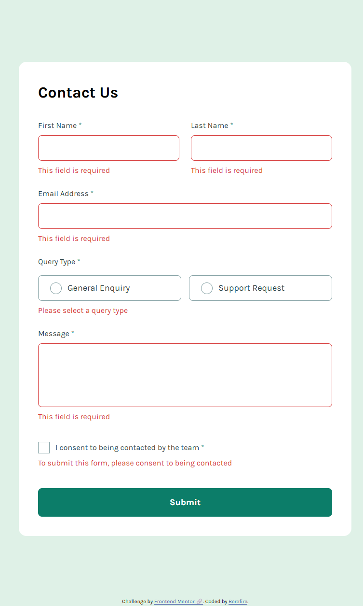 | 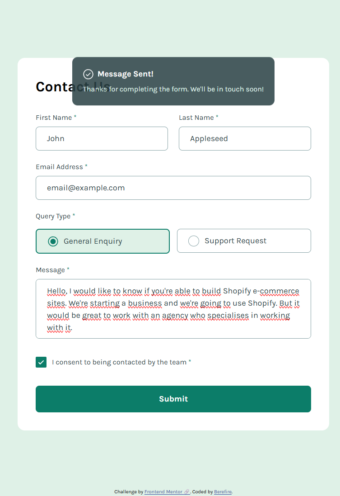 |

#### Desktop (1024x914)

| _Default_ | _Hover_ | _Active_ | _Error_ | _Success State_ |
| --------- | ------- | -------- | ------- | --------------- |
| 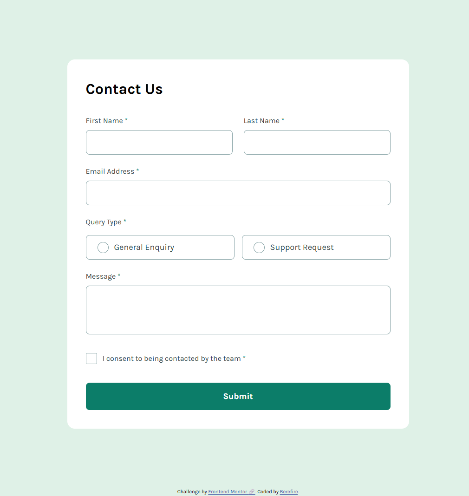 | 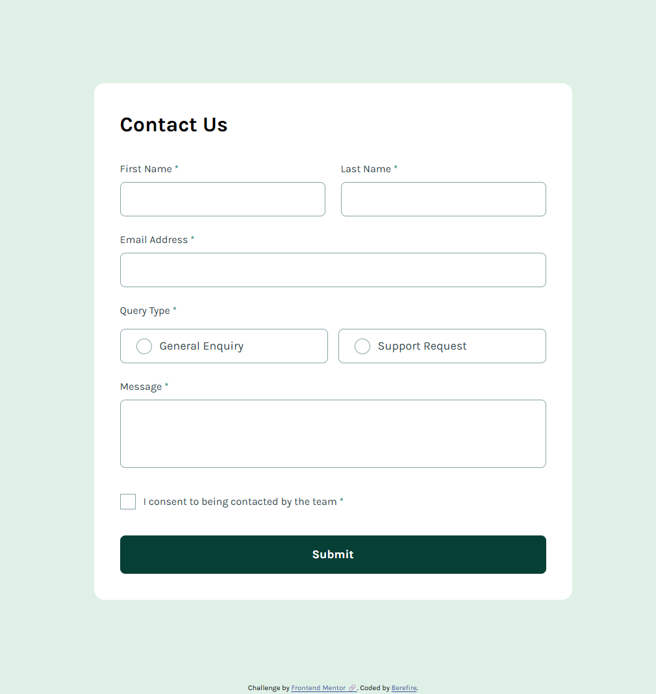 | 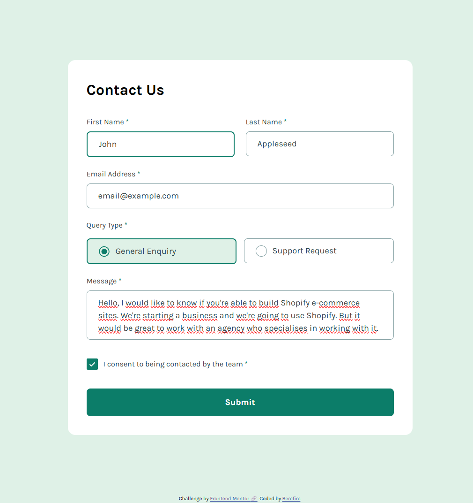 | 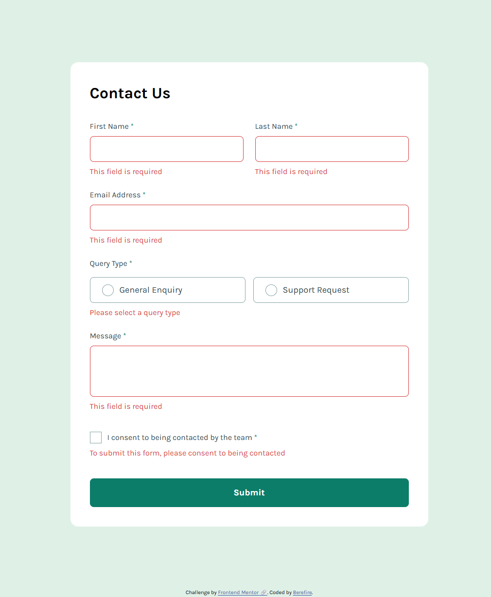 | 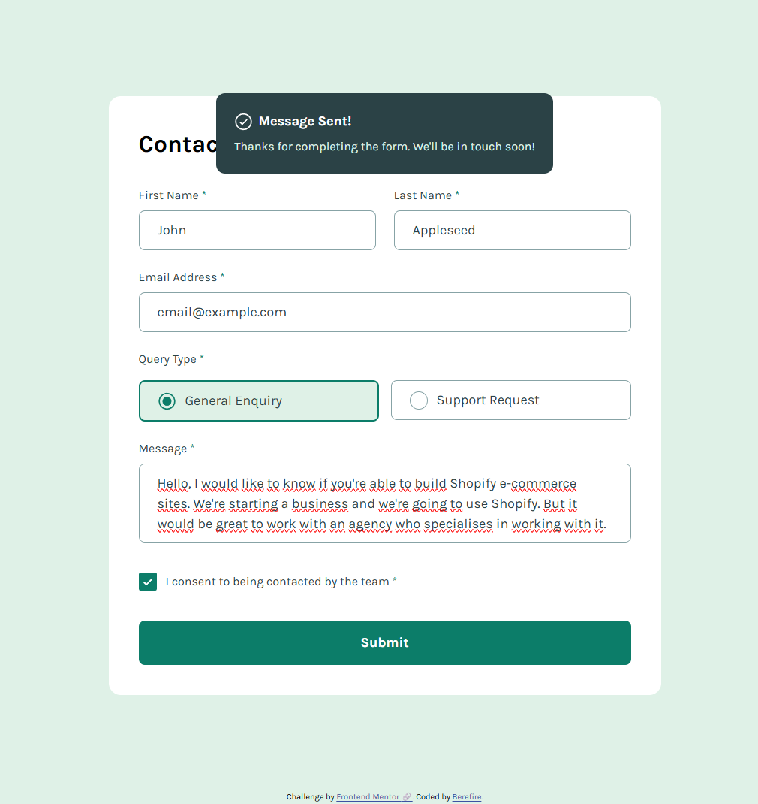 |

---

### 🔗Links

- Solution URL: [Add solution URL here](https://your-solution-url.com)
- Live Site URL: [https://berefire.github.io/contact-form/](https://berefire.github.io/contact-form/)

---

## ⚙️My process

### 🛠Built with

- Semantic HTML5 markup
- CSS custom properties
- Flexbox
- CSS Grid
- Mobile-first workflow
- CUBE CSS architecture
- Vanilla JavaScript (ES Modules)
- Accessible form validation
- ARIA attributes and live regions

---

### Architecture

This project follows a modular and feature-based architecture using Vanilla JavaScript and CUBE CSS principles.

```html
src/
│
├── js/
│   ├── contact-form/
│   │   ├── constants.js
│   │   ├── contact-form.js
│   │   ├── events.js
│   │   ├── ui.js
│   │   └── validation.js
│   │
│   ├── utils/
│   │   └── dom.js
│   │
│   └── main.js
│
└── styles/
```

The project separates:

- DOM utilities
- Validation logic
- UI state handling
- Event handling
- Component initialization

To improve maintainability and scalability.

---

### Accessibility

Special attention was given to accessibility and keyboard usability.

Features include:

- Semantic form structure using fieldset and legend
- Proper label associations
- Accessible error messages using `role="alert"`
- Success toast announcements using `role="status"` and `aria-live="polite"`
- Keyboard-accessible custom radio buttons
- Focus-visible styles for interactive elements
- Reduced motion support using prefers-reduced-motion
- Screen reader friendly decorative icons using `aria-hidden="true"`

---

### 💡What I learned

During this project, I improved my understanding of:

- Accessible form validation patterns
- Managing UI state with Vanilla JavaScript
- Creating reusable validation utilities
- Feature-based frontend architecture
- Building custom accessible radio buttons and checkboxes
- Implementing toast notifications accessibly
- Organizing CSS with CUBE CSS methodology

---

### 🚀Continued development

In future projects, I would like to continue improving:

- Advanced accessibility patterns
- Form validation architecture
- Component reusability
- Scalable CSS systems
- Animations with reduced-motion support
- Frontend performance optimization

---

### 📚Useful resources

- [CUBE CSS](https://cube.fyi/) - Helped me better understand composition-first CSS architecture.
- [MDN - details element](https://developer.mozilla.org/en-US/docs/Web/HTML/Element/details) - Useful for understanding native accordion accessibility behavior.
- [Every Layout](https://every-layout.dev/) - Great resource for modern layout composition techniques.
- [MDN - Logical properties](https://developer.mozilla.org/en-US/docs/Web/CSS/CSS_logical_properties_and_values) - Helped me use modern logical spacing properties effectively.

---

### 🤖AI Collaboration

AI tools were used during development to:

- Review accessibility implementations
- Improve semantic HTML structure
- Refactor validation logic
- Organize project architecture
- Improve CUBE CSS naming conventions
- Debug JavaScript issues
- Review focus management and ARIA usage

The collaboration was especially useful for:

- Accessibility reviews
- Modular architecture decisions
- Improving reusable UI patterns

---

## 👤Author

- Frontend Mentor - [@berefire](https://www.frontendmentor.io/profile/berefire)
- GitHub - [@berefire](https://github.com/berefire)

---

## 🙏Acknowledgments

Thanks to Frontend Mentor for providing practical challenges that help developers improve real-world frontend skills.

---
